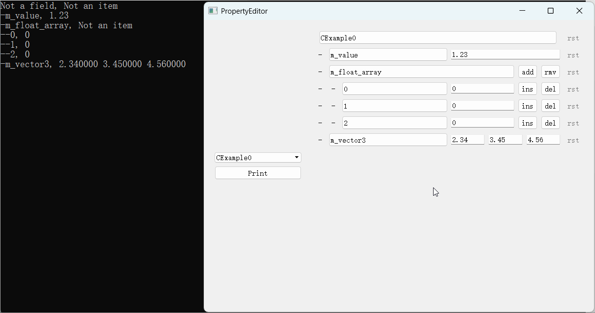

# Niflect Sample: Property Editor Framework

**NiflectSamplePropertyEditor** is a property editor framework that serves as an application sample of Niflect, demonstrating automatic binding between data types and UI editing controls through reflection.

**Niflect** is a native-style C++ reflection framework, that:

- Generates reflection metadata via **NiflectGenTool** (integrated into build systems)
- Uses macro tags to declare reflection targets

## Key Demonstrations

### 1. Reflecting Object Members to UI Controls

*Workflow:*

- Define C++ classes/members with Niflect macro tags
- Automatic UI control binding based on reflection metadata.

### 2. Editing and Resetting Properties

*Interactions:*

- Edit properties through generated UI controls
- Reset any property to its initial state

