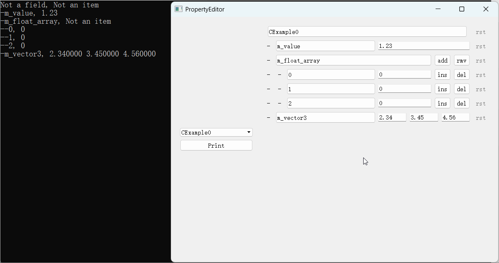

[English](Doc/English/README.md)

# Niflect 示例: 基于动态反射的属性编辑器框架

**NiflectSamplePropertyEditor** 是 **C++ 动态反射**的实用示例, 展示如何**自动绑定**数据类型与 UI 编辑控件, 如:

- 运行时编辑模块中的对象 (如 .so/.dll 中的对象)
- 无须头文件即可创建类型对应的属性控件
- 基于 **Niflect** 生成与获取反射元数据

**Niflect** 是一款 C++ 原生风格反射框架

- 通过集成在相应构建系统中的 **NiflectGenTool** 工具生成反射代码
- 解析声明式宏标签标记的类型或成员
- 在运行时初始化反射元数以实现动态反射

## 构建

```bat
git clone git@github.com:sainimu78/NiflectSamplePropertyEditor.git
cd NiflectSamplePropertyEditor
git submodule update --init --remote
```

### Windows

VS 2015+, 建议 VS 2022

Qt 5.8 的依赖已传至本仓库不必另外安装

```bat
cd Build\PropertyEditor\Windows
Generate.bat
Build.bat
::或打开 VS 操作 start DefaultBuild\PropertyEditor.sln, 须注意打开后不可升级平台工具集等项目配置
DefaultBuild\Debug\bin\PropertyEditor.exe
```

### Linux

建议 Ubuntu 20

须自行安装 Qt 5.12.8

```
cd Build/PropertyEditor/Linux
./Generate.sh
./Build.sh
./DefaultBuild/Debug/bin/PropertyEditor
```

## 特性

- 从 0 开始基于 Qt 实现工业级属性编辑框架, 代码仅 2000 行
- 可自定义任意类型序列化, 见 AccessorSetting.h
- 可自定义任意类型成员自动绑定 UI 控件, 见 `CVector3Accessor`
- 无静态类型依赖的任意类型属性树创建, 见 `BuildPropertyFromRwNode`
- 仅几十行代码实现任意类型编辑重置初始值的工业级编辑功能, 见 `QPropertyTree::ResetBranch`
- 可自定义编解码为任意格式的序列化, 见 `CJsonFormat::Write` 以 JSON 为例的序列化用法
- 数据层不与 UI 层耦合, UI 层可替换 见 PropertyNode.h

## 演示

### 1. 对象成员自动绑定 UI 控件


*工作流*

- 用 Niflect 的宏标签定义 C++ 类与成员
- 通过反射元数据自动绑定 UI 控件

### 2. 编辑与重置属性



*交互操作*

- 通过生成的 UI 控件编辑属性
- 属性重置按钮根据值变化相应启用或禁用
- 重置任意属性或属性组为初始状态

## 关于属性修改的 FAQ

关键代码入口 `QPropertyTree::MarkChangeFromUi`

### Q1: 本框架做法是否高效?

#### A1: 不高效. 如高效, 全面工业级编辑功能等实现, 可能意味着代码量 20000+ 行而非 2000+ 行, 关键点如:

##### 属性层框架

- 属性间联动的有效性更新, 如属性修改后的完整修改反应链条追踪, 典型的如
  - 一些编辑器端的输入值限制属性的修改, 需要联动所关联的属性值有效性更新
  - 一些以结构展开形式编辑的属性, 如 Vector3, 每个 Entry 的修改须联动更新到展开的 Entry, 如果结合值限制属性则情况更复杂
- 区分一些编辑控件的预览操作产生的修改, 典型的如可拖拽预览的数字编辑控件, 在预览时的修改不影响撤销栈, 同时能够保持修改的属性联动
- 这些复杂操作实现的关键方法是, 将属性的修改以一种树或图结构组织, 动态地遍历并添加子节点, 其中的动态要求是因为修改产生的结构不是固定的
  - 此框架的难点在于如何即实现有效性联动, 又保持属性定义方式仍简单

##### 属性控件层框架

- 为能够平衡通用性与性能, 必须在接受属性分支重建的基础上作相应的控件层优化.
- 尽可能仅在可见时更新
- 尽可能在重建后使控件保持重建前的编辑状态

##### 多个实例的属性同步联动编辑

- 包括控件被过滤时的同结构属性编辑
- 能够保持所有被修改的属性, 无冗余地联动有效性更新

### Q2: 如此精简的实现是否意味着没有实用性?

#### A2: 确有实用性. 精简的意义在于演示 A1 所述所有复杂实现背后的核心操作, 即整个分支重建. 因此实用性在于其精简地展示了所有复杂实现前的骨架流程, 以及基于反射元数据的实现方式可对框架通用性带来质变提升.

### Q3: 框架未实现撤销, 是否意味着不易实现?

#### A3: 须分 2 个层次解释此问题:

##### 可轻易实现

仅对于撤销/重做功能, 是能够极简实现的, 即通过属性树独立的 Save / Load 数据, 与撤销栈的进栈/出栈对应, 即可轻易实现任意操作可撤销, 此方法的致命问题是内存占用大且操作冗余.

##### 不易实现

因为需要在上述的方法基础上, 实现一种增量序列化, 撤销栈中只保存修改前后的差异数据. 此方法还可用于如要求仅传输变化属性数据的需求.

- 如果条件允许, 应能够实现如前述的通用撤销命令(撤销命令指典型命令模式撤销栈的 Undo Command)与仅记录必要操作信息以撤销的最优撤销命令
- 此外还有一大挑战是, 如何区分撤销操作与持久化的序列化流程, 避免流程复用导致的混乱
- 总之, 不易实现的问题确实存在, 但这是追求通用撤销必定面对与解决的困难