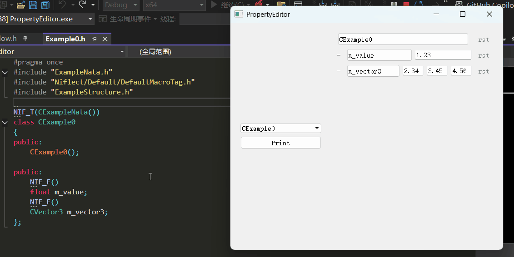

[English](Doc/English/README.md)

# Niflect 示例: 属性编辑器框架

**NiflectSamplePropertyEditor** 是一款属性编辑器框架, 作为 Niflect 的应用示例, 展示如何通过反射实现数据类型与 UI 编辑控件的自动绑定

**Niflect** 是一款 C++ 原生风格反射框架, 通过集成在相应构建系统中的 **NiflectGenTool** 工具生成反射代码, 使用者通过宏标签指定反射目标.

## 主要功能演示

### 1. 反射对象成员到 UI 编辑控件

*工作流*

- 用 Niflect 的宏标签定义 C++ 类与成员
- 通过反射元数据自动绑定 UI 控件

### 2. 编辑与重置属性

*交互操作*

- 通过生成的 UI 控件编辑属性
- 重置任意属性为初始状态

